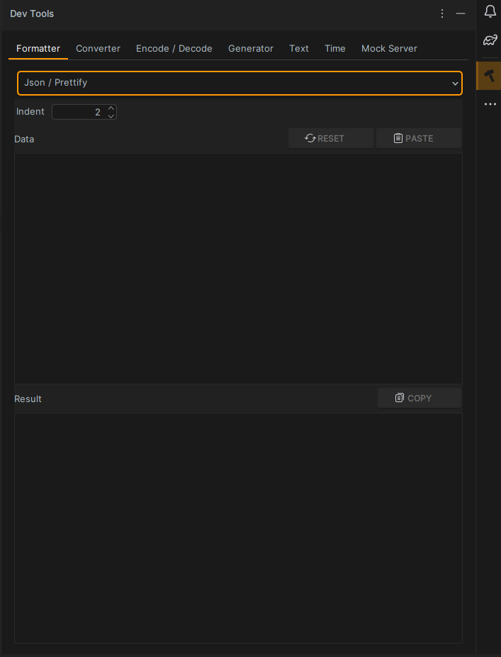
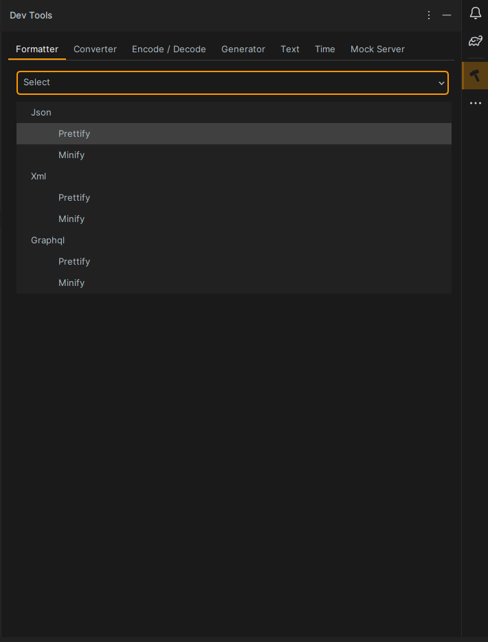

## dev-tools
This is a simple tool that could be helpful in your everyday development workflow

## Features
- Json Prettiy / Minify
- Xml Prettiy / Minify
- Graphql Prettiy / Minify
- Json to Properties
- Json to Yaml
- Yaml to Properties
- Text escape / unescape
- Base64 encode / decode
- URL encode / decode
- UUID generate
- Timestamp generate
- Mock server

## Screenshots

